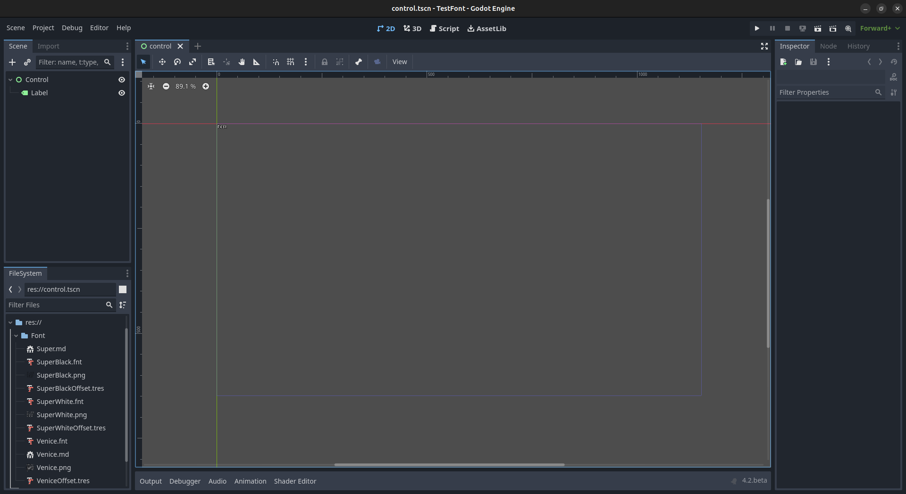
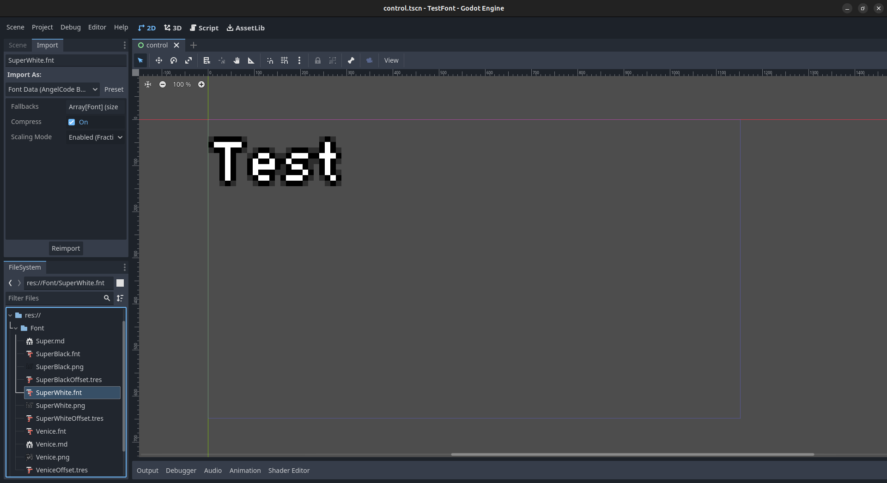

# Test Bitmap Font Scale

bitmap font scale is disabled in this test project import settings to begin with

- work
  - create a new scene with a label, or open `control.tscn`
  - uses `SuperWhite.fnt` (default font in project settings)
  - works fine, note size of font, normal, about the size of a default button or label, same size it was in 4.1

- not work:
  - change font scale in `SuperWhite.fnt` import settings to `fractional` (default)
  - need to reload project to use new settings?
  - note size of font, it is now much bigger, about 3x the size of a default button or label
  - want to check size of font but right half of editor is pushed off screen

to fix the editor temporarily can quit delete `.godot/imported` reload and will work till reload again

to fix editor permanently can disable bitmap font scaling!to fix the editor temporarily can quit delete `.godot/imported` reload and will work till reload again

to fix editor permanently can disable bitmap font scaling
